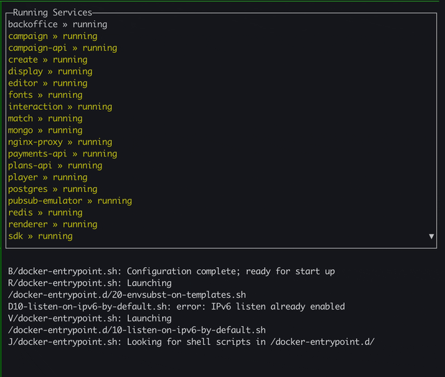

# governor
A Docker container watcher, written in Go.



**NOTE: This is a work in progress, and you are more than welcome to help and suggest improvements, I'm all ears!**

This tool was born out of the frustration of managing a multi-container development environment.  
Its sole purpose if to ease the management (start, stop, inspect etc.) of containers, and auto-recovery of failed containers.

## Installation

```
go get github.com/cudacoder/governor
```

## Usage

To use it, run your containers however you like (`docker run` or `docker-compose up`) and then simply run `governor` 
to see all of your running containers, and their most recent logs.

You can navigate the list using `j` and `k`, and restart selected service by hitting `r`.
